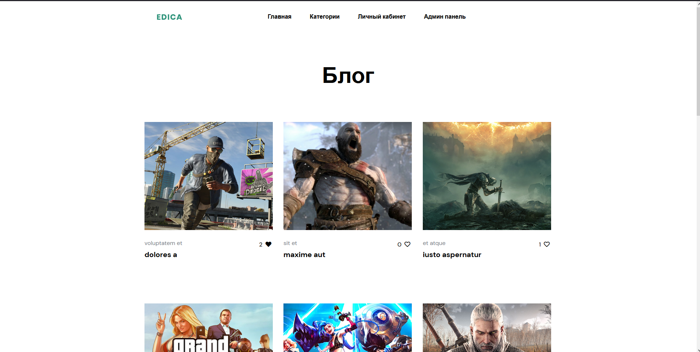
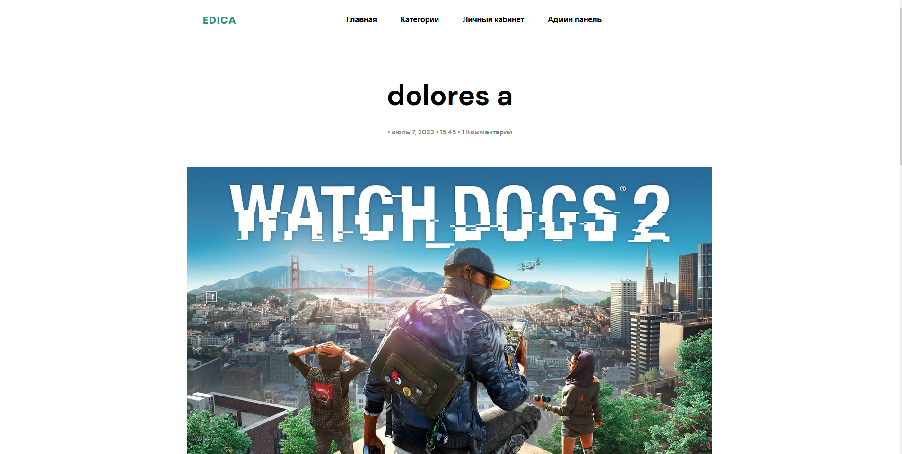
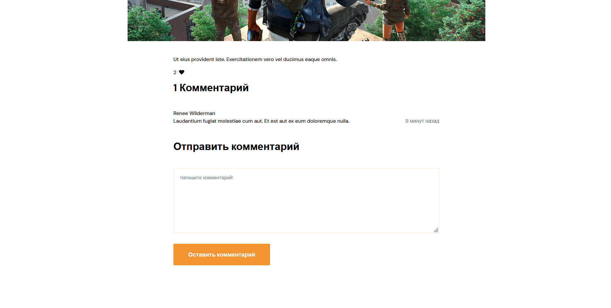
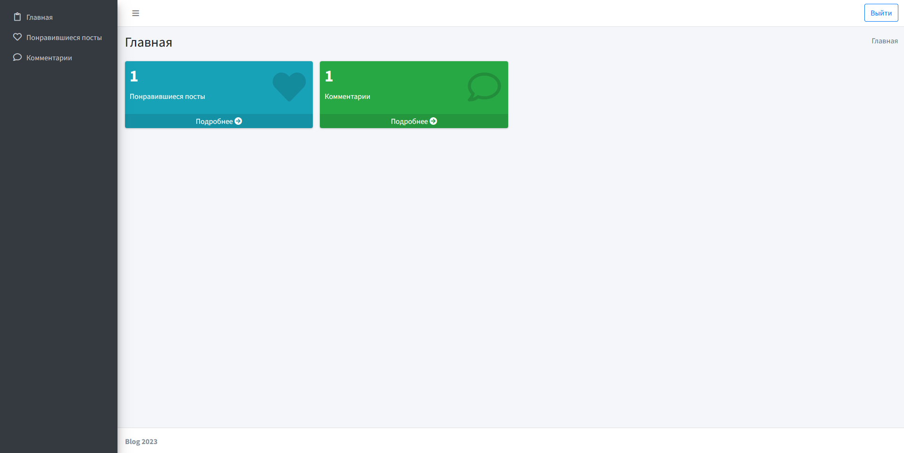
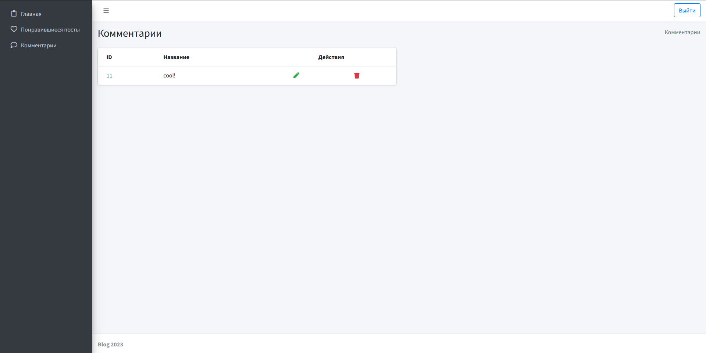
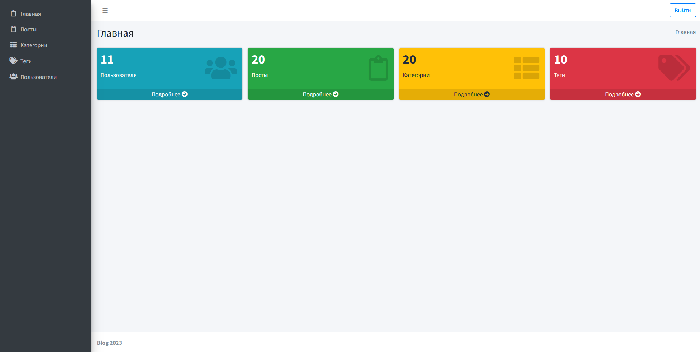
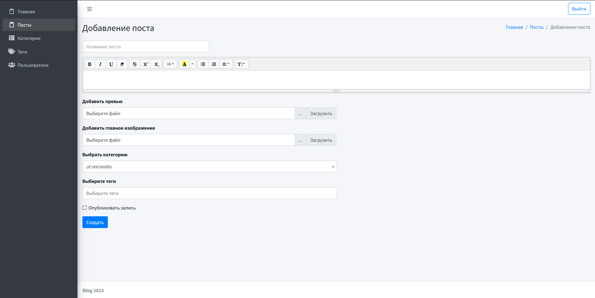

# Laravel Blog

### Installation

Setting up your development environment on your local machine :

- git clone https://github.com/sodaler/lar_blog.git
- cd lar_blog
- cp .env.example .env
- composer install
- npm install
- docker-compose up -d

---

### Before starting
You need to:  

Enter the app container:

- docker exec -it app bash

Run the migrations with seeds:

- php artisan migrate --seed

Generate storage link:

- php artisan storage:link

Starting job for registration:

- php artisan queue:listen

---

### Some Screenshots

### Blog

http://localhost:8877/posts

### Personal account

http://localhost:8877/personal/main

### Admin Panel

http://localhost:8877/admin/posts

